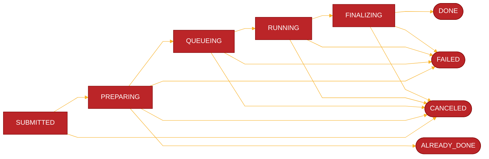
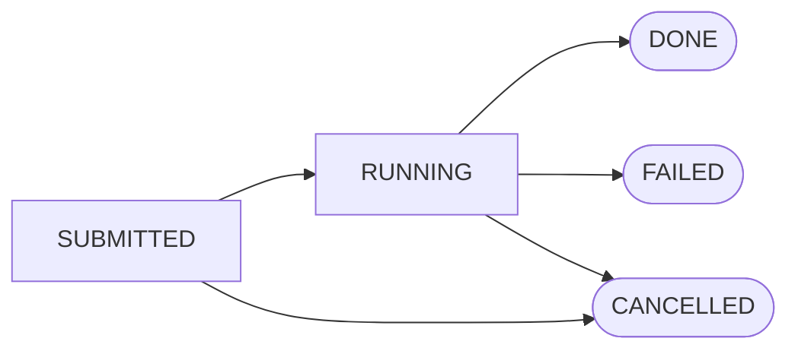

# Experiments
## Introduction

An Experiment in AXII is an execution of a workflow. It is immutable, meaning that once it has been submitted, it cannot be changed. This is important for maintaining the integrity and consistency of the results produced by the Experiment.

## Deep Dive

### Execution

After an Experiment is submitted, AXII's Orchestrator takes over and executes the Workflow. Each Node within the Workflow goes through multiple stages during the execution, which are described below. The state of the whole Experiment is a derivative of its Nodes' statuses. Internally, a Node is translated to a Kubernetes' Job, ensuring reliable and scalable execution.

#### Node States

This chart illustrates the different states that a Node can transition through during the execution of an Experiment.

#### Experiment States

This chart shows the possible states of an Experiment, which are determined by the statuses of its Nodes.

### Artifacts Cache

AXII takes care of optimizing the execution and avoiding redundant, repeated computation. It does this by maintaining an Artifacts Cache. When looking for a cache entry, AXII takes into account various factors, such as the Node's Task, whether the Task is deterministic or not, the Node's inputs, parameters, and Runtime.

If a valid cached Artifact is found, AXII skips the execution of the Node and sets its state to `Already Done`. This significantly improves the efficiency of the Experiment execution.

### Autoscaling & Queueing

Depending on the configuration, AXII can scale compute resources to match the current demand and/or use queueing. This ensures that the platform can handle varying workloads and efficiently distribute resources among different Experiments.

### Recurring Experiments

AXII supports scheduling Experiments, which is useful for executing Experiments based on time intervals. This feature, together with Macros, allows users to create dynamic Workflows to, for example, fetch and process daily data for later use in model training Workflows. This makes it easy for users to keep their models up-to-date with the latest data and trends.